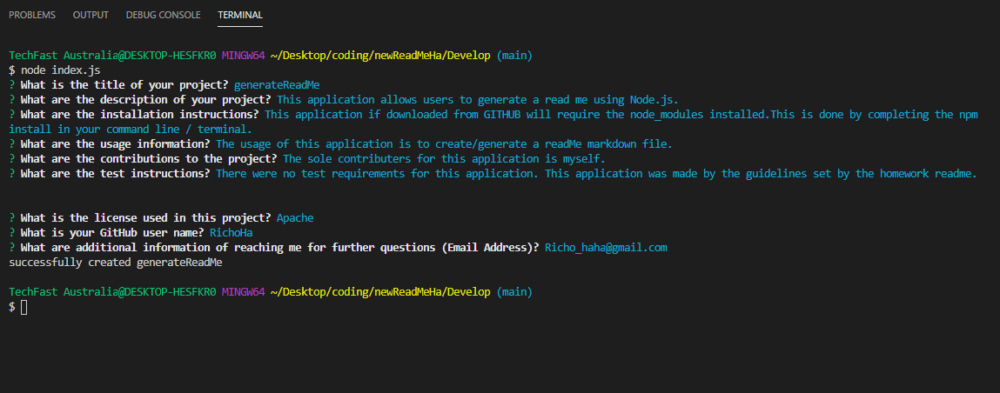
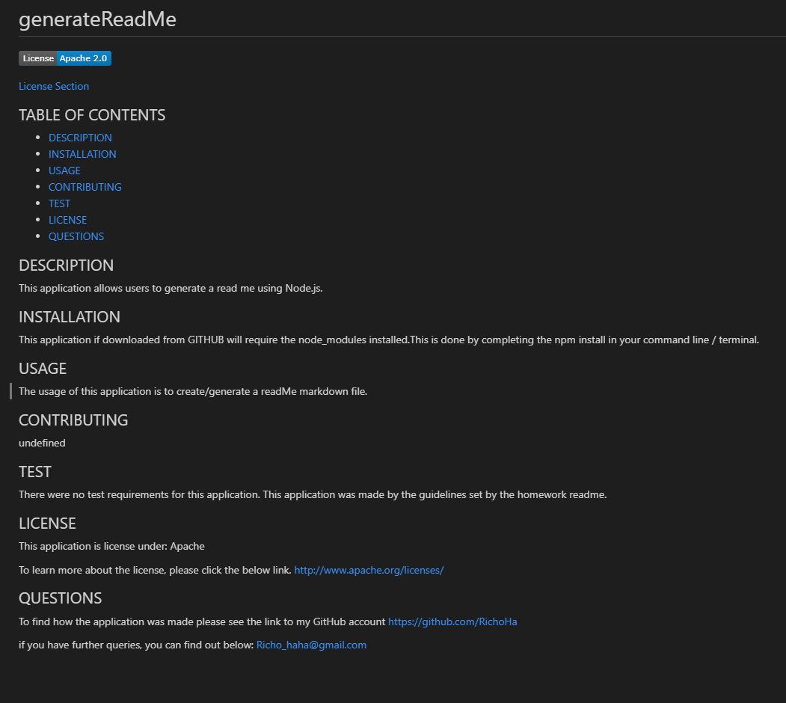

# TITLE

## Description
This application allows users to generate a read me using Node.js.
Application saves the readme file as the title. 

## GitHub Repo for this project
https://github.com/RichoHa/newReadMeHa

## Table of Contents
-   Installation
-   Usage
-   License
-   Contributors 
-   Tests
-   Questions

## Installation
This application if downloaded from GITHUB will require the node_modules installed.
This is done by completing the npm install in your command line / terminal.

## Usage
The usage of this application is to create/generate a readMe markdown file. 
See photo examples below.

### Snippet of Terminal 

### Snippet of Created ReadMe 

## LIcense
There are no license for this project as it is publically available. 

## Contributors 
The sole contributers for this application is myself. 

## Tests
There were no test requirements for this application. 
This application was made by the guidelines set by the homework readme. 

## Questions
The codes to the application is made public and can be found in the below GitHub link:
https://github.com/RichoHa

Link of video, using the application:
https://youtu.be/Avm1Ibfw158

or feel free to email me on Richo_haha@gmail.com.